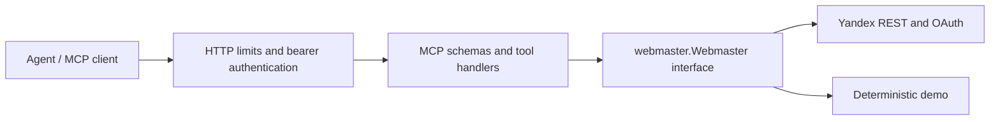

# Architecture

`cmd/mcp-server` wires configuration, lifecycle and dependencies. `internal/httpserver` owns transport boundaries; `internal/auth` owns bearer validation. `internal/mcpserver` translates tool arguments and results. `internal/webmaster` owns domain validation and Yandex integration. Handlers depend on the capability interface rather than HTTP or token details; test and demo implementations exercise that boundary.

Protocol schemas remain in the MCP adapter; Yandex wire-format mapping and retry policy remain in the client. Most tools return Webmaster JSON objects unchanged so agents see the same field names as the public API.

The server uses stateless Streamable HTTP and has no persistent application database. Each process has its own user-id cache and concurrency limit. More replicas increase aggregate pressure on Yandex quotas: coordinate limits externally before scaling replicas. There is no per-user isolation, distributed rate limiter or interactive OAuth flow. Separate installations are the supported boundary for unrelated users.

Cancellation covers queued work and upstream requests. Bounded concurrency, retries, request bodies and response bodies constrain resource use. This is suitable for a self-hosted owner or trusted team; no throughput benchmark is claimed.

ACDD requires exactly one file per commit, including tests and dependent configuration. Use compatible intermediate steps and preserve the sequence during integration.
